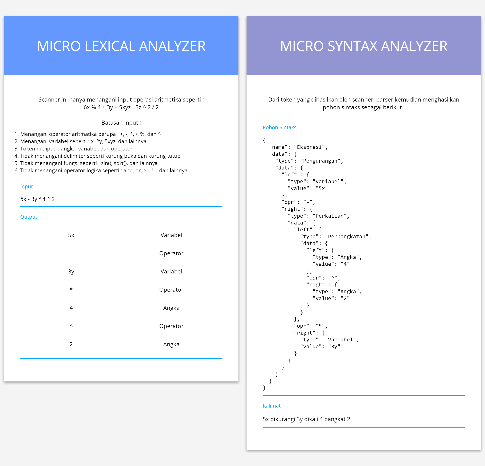
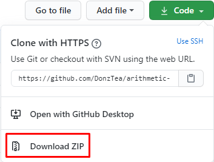

# Implementasi Scanner dan Parser dalam Operasi Aritmatika Sederhana pada Compiler

Aplikasi ini merupakan penerapan dari cara kerja scanner dan parser pada sebuah compiler dalam menangani operasi aritmatika sederhana.

## Antarmuka aplikasi



## Disclaimer

> Aplikasi ini hanya sebatas tugas kuliah saya.

## Instalasi

Ada dua cara instalasi yang saya uraikan, silakan gunakan cara yang dirasa nyaman dan familiar. Bagi yang terbiasa dengan perintah git, silakan gunakan [cara pertama](#instalasi-dengan-cara-clone-git-repository). Jika tidak familiar dengan git, bisa gunakan [cara kedua](#instalasi-dengan-cara-download-zip).

### Instalasi dengan cara clone git repository

Pada command prompt / terminal, eksekusi perintah berikut ini :

```
git clone git@github.com:DonzTea/arithmetic-scanner-and-parser-in-compiler.git
```

### Instalasi dengan cara download zip

1. Download source code dalam bentuk zip dengan cara klik tombol code, kemudian klik download zip seperti gambar di bawah ini.

<p align="center">
  
</p>

2. Extract file zip yang telah didownload.

## Menjalankan aplikasi

Buka index.html pada browser.
